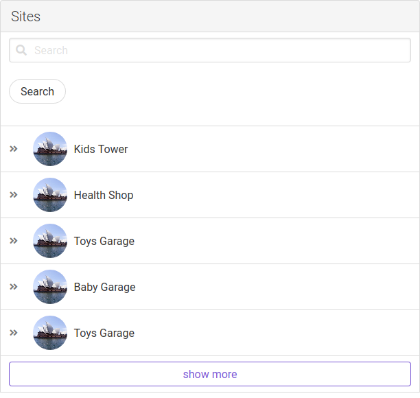
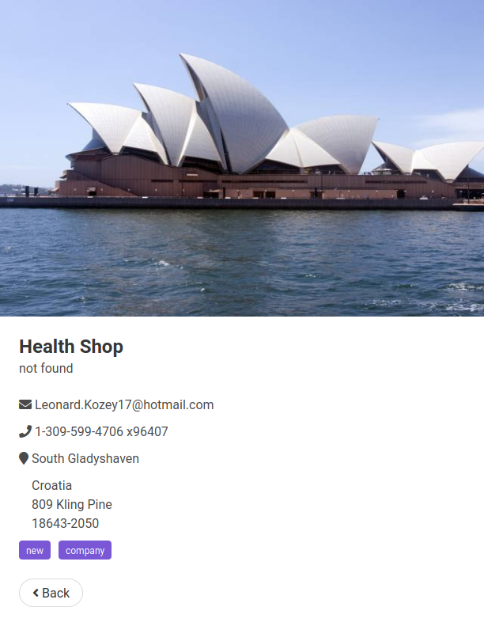

## Description

vuejs test

## Current Version

0.0.1

## Author

Aziz Gharbi

## Notes

- It's been a while that i didn't use vuejs (more than a year) so if there is new features that i didn't implement, I may be outdated.
- In case of watching files failed with webpack please update webpack `Global version -g`
- I am using `Live server` extension on vs code to browse the html file and for live reload
- You can run `npm install` to install packages
- You can run `npm run watch` to start webpack watcher
- You can open the `index.html` directly to see the demo

## technologies

- Buefy (ui framework for vue js based on bluma css)
- Vuejs
- webpack (module bundler)

## Why

`I used only vuejs and webpack to generate the full application. because i didn't find the need to use (vue-cli,vuex,vue-router for only two screens), basically : vuejs + customized webpack config`

## Demo

