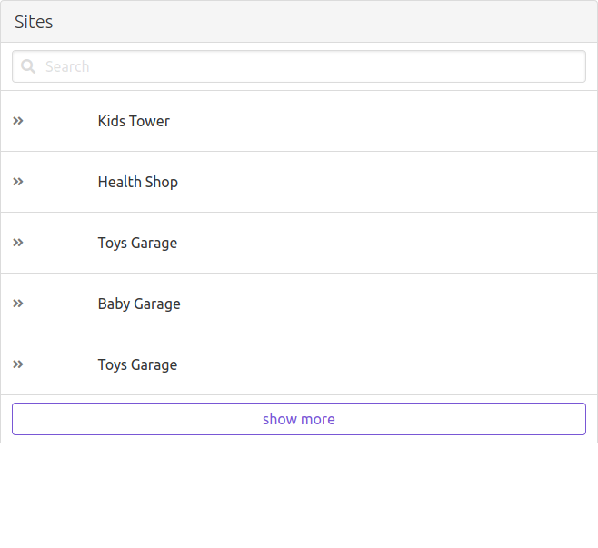

## Description

vuejs test

## Current Version

0.0.1

## Author

Aziz Gharbi

## Notes

`Recently i am only working with react and it's been a while that i didn't use Vuejs (more than a year) so if there is new features that i didn't implement, I may be outdated. 
Anyway fundamentals are forever shinny libraries are short term.`

## Development

- In case of watching files failed with webpack please update webpack `Global version -g`.
- I am using `Live server` extension on vs code to browse the html file and for hot reload.
- You can run `npm install` to install packages.
- You can run `npm run watch` to start webpack watcher.
- You can open the `index.html` directly to see the demo.

## technologies

- [buefy](https://buefy.org/) (ui framework for vue js based on bluma css)
- Vuejs
- webpack (module bundler) plugins [@babel/plugin-proposal-optional-chaining](https://babeljs.io/docs/en/babel-plugin-proposal-optional-chaining)

## Why

`I used only vuejs and webpack to generate the full application. because i didn't find the need to use (vue-cli,vuex,vue-router for only two screens), Basically i am using : vuejs + customized webpack config`

## Cons

- without vue-router we don't for example have the ability to send a specific link for a site details.

## Nice to have:

- Typescript.

## Demo

